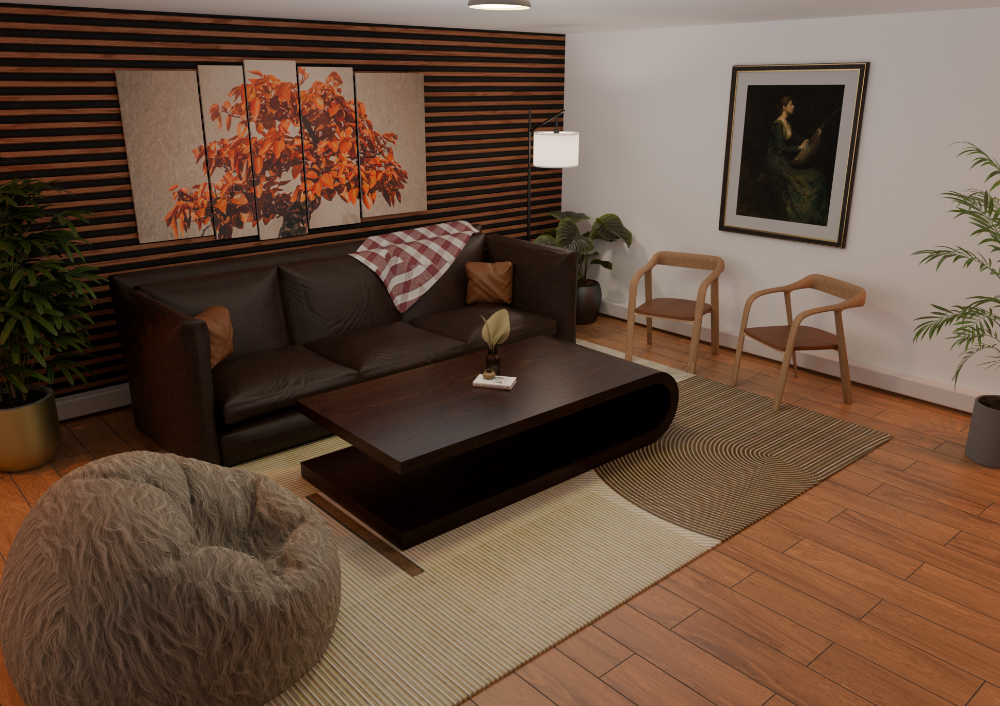

# Room Structure Design

A modern interior room design created in Blender, focusing on 3D modeling, material design, lighting, composition, and realistic rendering.

## Project Overview

This project represents a contemporary living room environment designed and developed entirely in Blender. The scene combines custom-modeled furniture, architectural elements, decorative objects, materials, and lighting to create a warm and realistic interior atmosphere.

## Key Features

- Modern living room interior design
- Custom 3D modeling of furniture and room elements
- Wooden flooring and decorative wall paneling
- Sofa, coffee table, chairs, and bean bag
- Interior plants and decorative accessories
- Wall-mounted artwork and multi-panel wall decoration
- Realistic material and texture setup
- Interior lighting and ambient illumination
- Camera composition and scene framing
- Final rendered visualization

## Blender Skills Used

- 3D Modeling
- Interior Design
- Material Creation
- Texturing
- Lighting
- Camera Composition
- Scene Setup
- Rendering

## Software

- Blender

## Project Goal

The goal of this project was to create a complete interior environment while practicing 3D modeling, material development, lighting, and realistic scene composition in Blender.

## Preview

